git clone - команда для клонування репозиторію  
cd - команда для переходу у директорію створенного репозиторію  
docker compose watch - команда для запуску проекту  
 
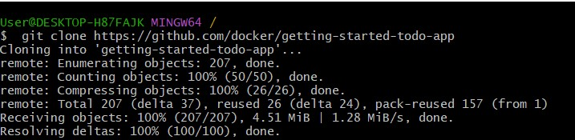 
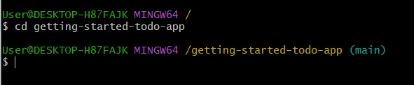 
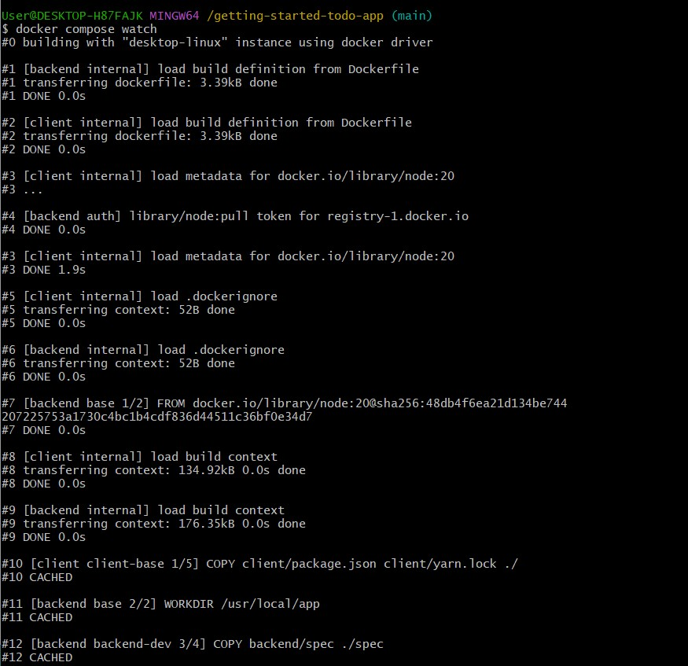 
 
запускаємо застосунок 
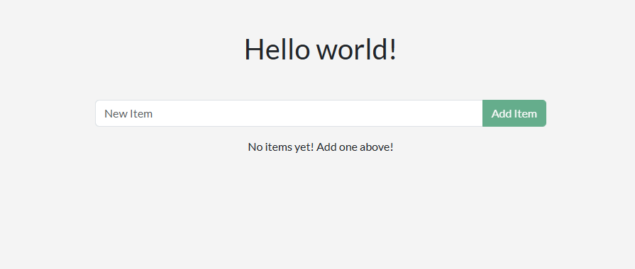 
 
вносимо зміни до коду (привітання)  
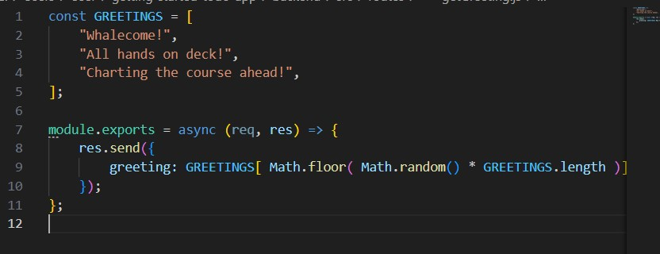 
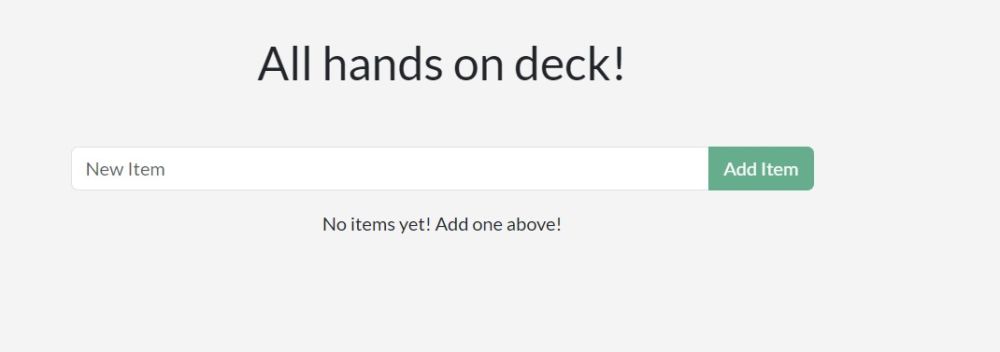 
 
вносимо зміни до коду (form)  
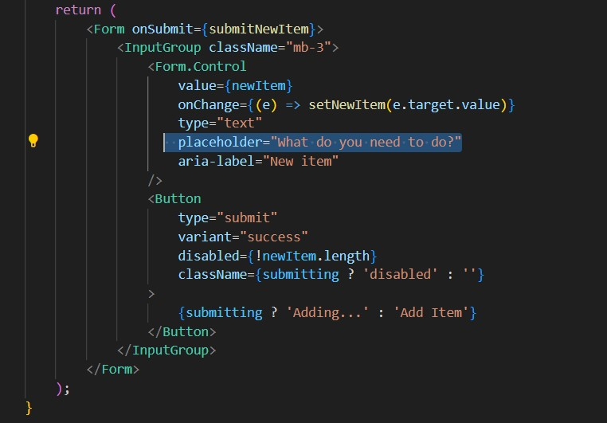 
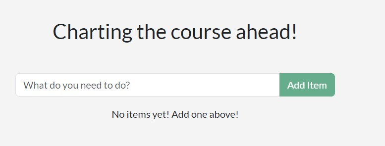 
 
вносимо зміни до коду (стилі)  
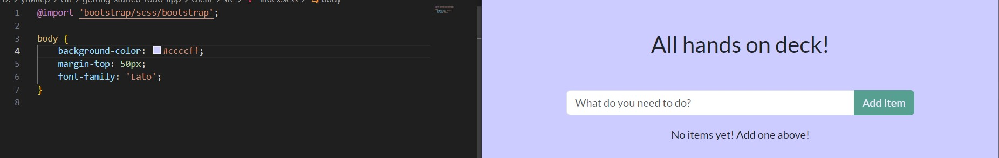 
 
 
Переходимо до Docker Hub та створюємо свій репозиторій 
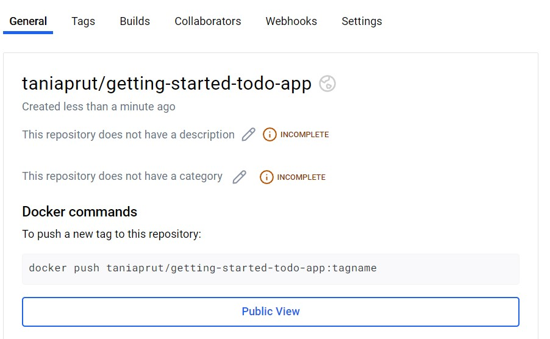 
 
 
створюємо проект: 
docker image ls - перевіряємо існування локального зображення 
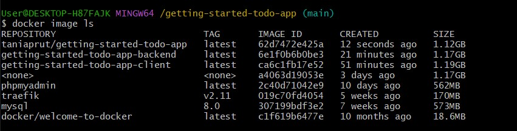 
docker push taniaprut/getting-started-todo-app - надсилаємо зображення в репозиторій. 
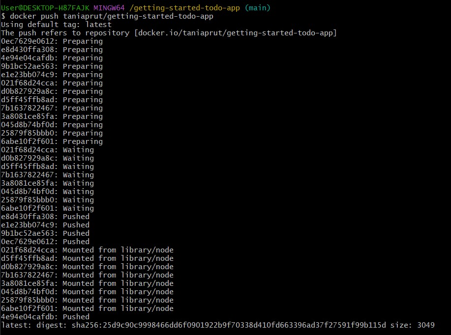 
 
Результат:  
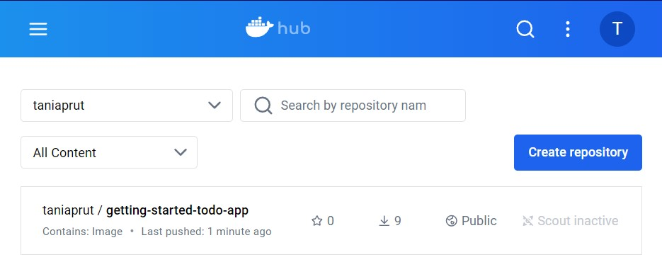 