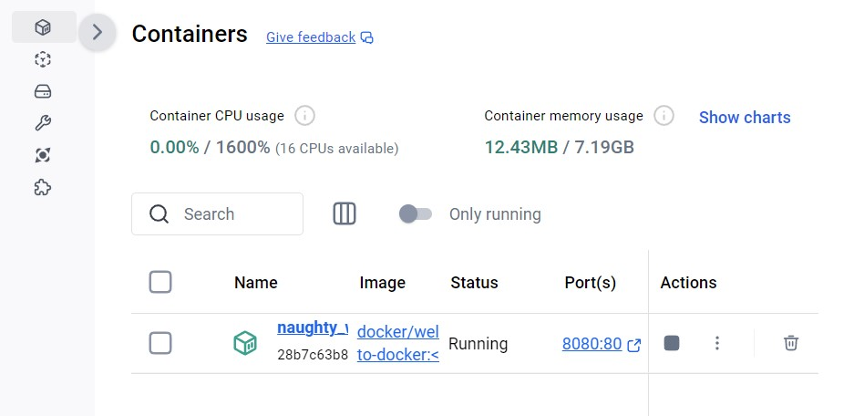

# docker
Таня Прут ІПЗ 4.02
 
 

# Вступ

## Запускаємо свій перший контейнер  

## Керуємо контейнерами за допомогою Docker Desktop  
 відкриваємо Docker Desktop і в лівій бічній панелі вибираємо коле "Контейнери".  

тут ми можемо переглянути свої контейнери та інформацію про них, включаючи журнали та файли, і навіть отримати доступ до оболонки, вибравши вкладку Exec. 

в полі Inspect ми можемо отримати детальну інформацію про контейнер, виконувати різні дії (призупиняти, відновлювати, запускати та зупиняти контейнери, або досліджувати вкладки «Журнали» , «Прив’язки» , «Виконання» , «Файли » та «Статистика») 

 
## Розвиток з контейнерами
Щоб розпочати роботу, клонуємо проект на свою локальну машину

Після цього, переходимо до нового каталогу, створеного клоном

Щоб запустити проект, виконуємо наступну команду 

Ми бачимо результат, який показує зображення контейнерів, які знімаються, контейнери запускаються тощо. 
 
 
## Вносимо зміни в додаток 
#### Зміни привітання 

Зберігаємо файл. Після оновлення веб-переглядача, ми бачимо нове привітання. 

#### Зміна тексту заповнювача 

#### Зміна кольору фону 

 
 
## Створіть і просуніть свій перший образ
 
Створюємо репозиторій

 
Команда docker build -t <DOCKER_USERNAME>/getting-started-todo-app . використовується для створення Docker-образу з Dockerfile, розташованого в поточній директорії. 

Щоб перевірити наявність зображення локально, ми можемо скористатися docker image ls командою:

Команда docker push <DOCKER_USERNAME>/getting-started-todo-app використовується для завантаження створеного Docker-образу до реєстру DockerHub 

 
# Концепції Docker 

## Основи 
### Що таке контейнер?
Контейнер — це просто ізольований процес з усіма файлами, які йому потрібні для запуску. 
Запускаємо контейнер Docker за допомогою графічного інтерфейсу Docker Desktop: 
1. Відкриваємо Docker Desktop і виберіть поле пошуку на верхній панелі навігації.
2. Вказуємо welcome-to-dockerв полі пошуку, а потім виберіть кнопку Pull .
3. Після успішного отримання зображення натисніть кнопку «Виконати» .
4. Розгортаємо Додаткові параметри
5. вказуємо ім'я, порт хоста
6. вибираємо "запустити", щоб запустити контейнер
7. Щоб відкрити веб-сайт, вибераємо посилання в стовпці Port(s) вашого контейнера 
 
Досліджуємо свій контейнер: 
1. переходимо до перегляду контейнерів
2. вибираємо свій контейнер
3. вибираємо вкладку «Файли» , щоб дослідити ізольовану файлову систему вашого контейнера. 
 
Зупиняємо свій контейнер: 
1. переходимо до перегляду контейнерів
2. знаходимо контейнер, який потрібно зупинити
3. вибираємо дію "зупинити"  в стовпці "дії" 
  
### Що таке імідж?
### Що таке Реєстр?
### Що таке Docker Compose?
