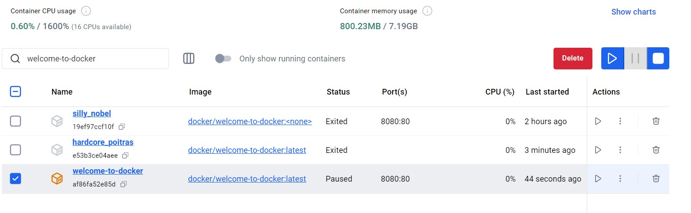

# docker
Таня Прут ІПЗ 4.02
 
 

# Вступ

## Запускаємо свій перший контейнер  

## Керуємо контейнерами за допомогою Docker Desktop  
 відкриваємо Docker Desktop і в лівій бічній панелі вибираємо коле "Контейнери".  

тут ми можемо переглянути свої контейнери та інформацію про них, включаючи журнали та файли, і навіть отримати доступ до оболонки, вибравши вкладку Exec. 

в полі Inspect ми можемо отримати детальну інформацію про контейнер, виконувати різні дії (призупиняти, відновлювати, запускати та зупиняти контейнери, або досліджувати вкладки «Журнали» , «Прив’язки» , «Виконання» , «Файли » та «Статистика») 

 
## Розвиток з контейнерами
Щоб розпочати роботу, клонуємо проект на свою локальну машину

Після цього, переходимо до нового каталогу, створеного клоном

Щоб запустити проект, виконуємо наступну команду 

Ми бачимо результат, який показує зображення контейнерів, які знімаються, контейнери запускаються тощо. 
 
 
## Вносимо зміни в додаток 
#### Зміни привітання 

Зберігаємо файл. Після оновлення веб-переглядача, ми бачимо нове привітання. 

#### Зміна тексту заповнювача 

#### Зміна кольору фону 

 
 
## Створіть і просуніть свій перший образ
 
Створюємо репозиторій

 
Команда docker build -t <DOCKER_USERNAME>/getting-started-todo-app . використовується для створення Docker-образу з Dockerfile, розташованого в поточній директорії. 

Щоб перевірити наявність зображення локально, ми можемо скористатися docker image ls командою:

Команда docker push <DOCKER_USERNAME>/getting-started-todo-app використовується для завантаження створеного Docker-образу до реєстру DockerHub 

 
# Концепції Docker 

## Основи 
### Що таке контейнер?
Контейнер — це просто ізольований процес з усіма файлами, які йому потрібні для запуску. 
Запускаємо контейнер Docker за допомогою графічного інтерфейсу Docker Desktop: 
1. Відкриваємо Docker Desktop і виберіть поле пошуку на верхній панелі навігації.
2. Вказуємо welcome-to-dockerв полі пошуку, а потім виберіть кнопку Pull .
3. Після успішного отримання зображення натисніть кнопку «Виконати» .
4. Розгортаємо Додаткові параметри
5. вказуємо ім'я, порт хоста
6. вибираємо "запустити", щоб запустити контейнер
7. Щоб відкрити веб-сайт, вибераємо посилання в стовпці Port(s) вашого контейнера 
 
Досліджуємо свій контейнер: 
1. переходимо до перегляду контейнерів
2. вибираємо свій контейнер
3. вибираємо вкладку «Файли» , щоб дослідити ізольовану файлову систему вашого контейнера. 
 
Зупиняємо свій контейнер: 
1. переходимо до перегляду контейнерів
2. знаходимо контейнер, який потрібно зупинити
3. вибираємо дію "зупинити"  в стовпці "дії" 
  
### Що таке імідж?
1. Знайдіть і завантажте зображення
2. Пошук зображення для зпуску
3. Після завершення пошуку обираємо docker/welcome-to-dockerзображення
4. Напискаємо Pull щоб завантажити зображення
    
5. на інформаційній панелі Docker вибераємо перегляд зображень
6. обираємо потрібне зображення
7. сторінка деталей надає інформацію про шари зображення, пакунки та бібліотеки, встановлені в образі, а також будь-які виявлені вразливості
    
### Що таке Реєстр?
1. створюємо новий репозиторій
  
2. Клонуємо репозиторій GitHub за допомогою такої команди:
  
3. Переходимо у щойно створений каталог
  
4. Команда docker build -t <YOUR_DOCKER_USERNAME>/docker-quickstart . використовується для створення Docker-образу на основі файлів у поточній директорії.
  
5. Щоб отримати список щойно створеного образу виконуємо наступну команду
  
6. запускаємо контейнер, щоб перевірити зображення, виконавши таку команду
  
7. використовуємо docker tag команду, щоб позначити зображення Docker.
  
8. відправляємо щойно створений образ у ваш репозиторій Docker Hub за допомогою команди docker push:
  
9. відкриваємо Docker Hub і переходимо до свого сховища. Переходимо до розділу «Теги» та переглядаємо щойно надіслане зображення.
  
### Що таке Docker Compose?
1. Клонуємо зразок програми
2. переходимо до каталогу
  
3. запускаємол програму
  
4. видкриваємо сайт в веб-перегладачі
  
5. використовуємо docker compose down команду, щоб видалити все
  
  
## Побудова образів 
### Розуміння шарів зображення
#### Створіть базове зображення
1. Зпаускаємо новий контейнер
  
2.усередині контейнера виконуємо команду, щоб установити Node.js:
  
3. перевіряємо чи встановлено Nodе
  
4. Команда docker container commit використовується для створення нового образу з поточного стану запущеного або зупиненого контейнера. Це дозволяє зафіксувати всі зміни, зроблені всередині контейнера (наприклад, встановлення нових програм або налаштування конфігурацій), і зберегти їх як новий Docker-образ для подальшого використання.
5. переглядаємо шари нашого зображення за допомогою docker image history команди
  
6. Щоб підтвердити, що на нашому образі встановлено Node, ми можемо створити новий контейнер, використовуючи цей новий образ. Після цього ми отримали вихід «Знову привіт» у терміналі, показуючи, що Node встановлено та працює.
7. видаляємо контейнер. команда docker rm -f app-container успішно видалила контейнер під назвою app-container. Результатом є повернення імені контейнера (app-container), що свідчить про успішне виконання команди.
  
#### Створіть образ програми 
1. запускаємо новий контейнер, використовуючи щойно створений образ бази вузлів
2. усередині цього контейнеру виконуємо команду, щоб створити програму Node
3. щоб запустити цю програму використовуємо наступну команду та почимо повідомлення, надруковане на екрані
  
4. в іншому терміналі виконуємо команду, щоб зберегти зміни контейнера як нове зображення. Ця команда не тільки створює нове зображення під назвою sample-app, але також додає до зображення додаткову конфігурацію, щоб встановити команду за замовчуванням під час запуску контейнера.
5. у термінали за межами контейнера виконуємо команду, щоб переглянути оновлені шари
  
6. запускаємо новий контейнер, використовуючи абсолютно нове зображення
7. видаляємо контейнери
  
### написання файлу Docker
### створіть, позначте та опублікуйте зображення
### Використання кешу збірки 
### Багатоетапні збірки
